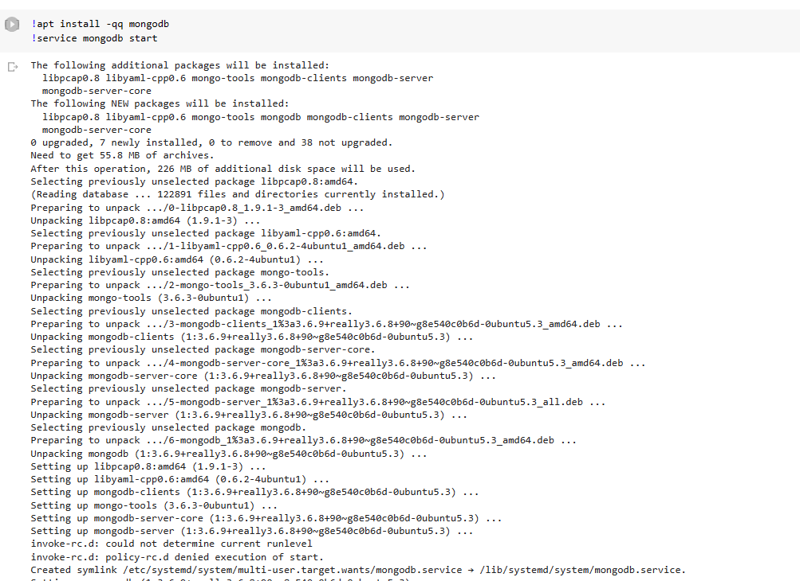

# PySpark_Knowledge
This repository will descibe all my knowledge about PySpark. All my knowledge are from lab assignments of "Big data introduction" in my university.

## 0. Individual introduction: 
| Full Name                  |   Student's ID   | Student's Email                    |      Individual Email              |
|:--------------------------:|:----------------:|:----------------------------------:|:----------------------------------:|
| Nguyễn Hoàng Thịnh         |  20120587        | 20120587@student.hcmus.edu.vn      | hoangthinhstkt@gmail.com           |

## 1. Content: 
- **PySpark_1.ipynb** *(Apache Spark with MongoDB)* 

**Note**: 
I run all file notebook in colab, but now it is having some problem with mongodb server: 

*(This is the code I run successfully in the past)*

Therefore, you should see the output of each cell to see every results I did with my knowledge about Spark.

- **PySpark_2.ipynb**

=> Using PySpark RDD and DataFrame to perform some querry tasks, beside PySpark_2 have some algorithm in "Data Mining" such as: Frequent patterns and association rules mining, FPgrowth, classification,... 